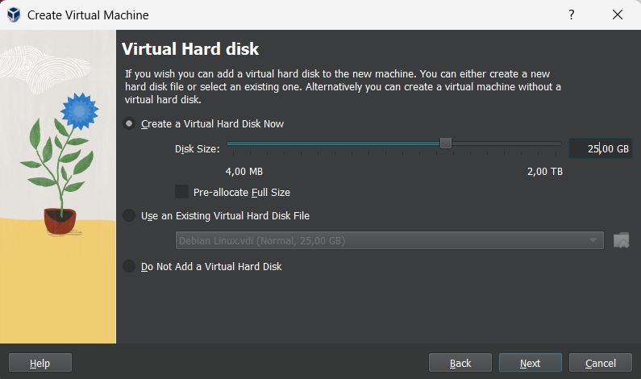
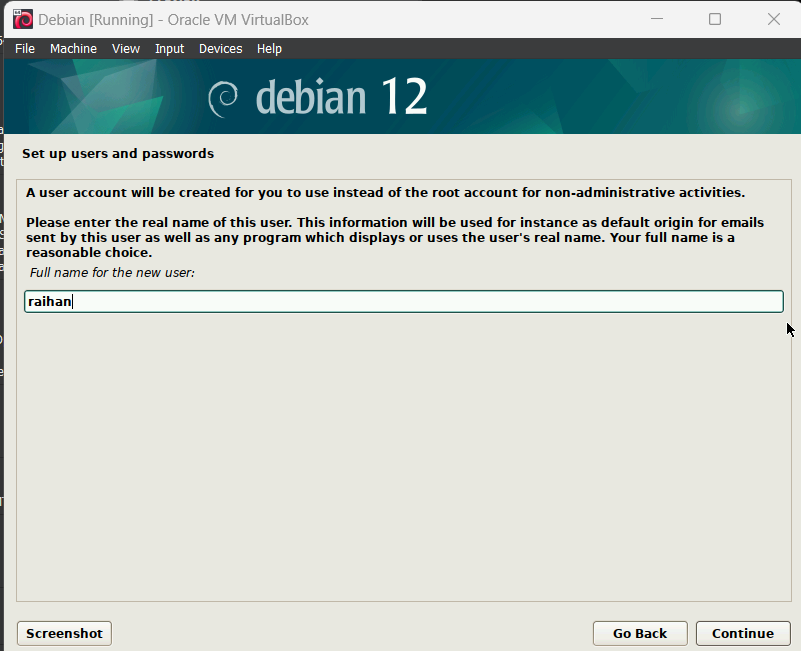
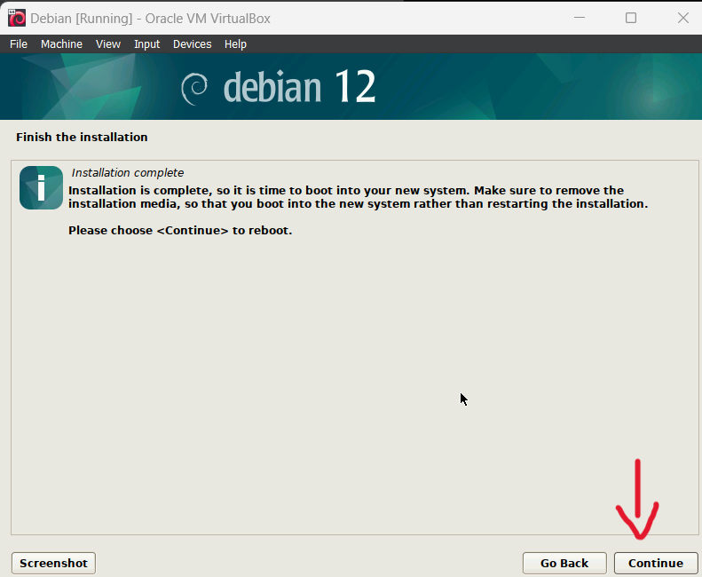

- # _INSTALASI DEBIAN 12 VIRTUAL BOX_

## Prerequisites

#### Sebelum memulai instalasi pastikan terlebih dahulu:

- Virtual box telah terpasang
- File ISO linux Debian 12 (Bookworm)

## Step 1 Create Virtual Machine

1. Buka virtual box lalu pilih New.

2. Beri nama sesuai keinginan, pilih direktori penyimpanan linux, dan pilih iso file yang telah diunduh. Jangan lupa ceklis juga pada (skip unattended instalation).

3. Sesuaikan jumlah memory ram dan cpu yang ingin dipakai.

4. Sesuaikan jumlah penyimpanan yang ingin dipakai.

5. Setelah selesai klik Finish.

## Step 2: Instalasi Debian

1. Restart your computer and enter the BIOS settings.

2. Change the boot order to prioritize the USB drive.

3. Save the changes and exit the BIOS settings.

## Step 3: Konfigurasi Awal

1. Select the "Install Linux" option from the boot menu.
2. Follow the on-screen instructions to configure your language, keyboard layout, and timezone.
3. Choose the installation type (e.g., alongside an existing operating system or on a separate partition).
4. Set up your username, password, and computer name.
5. Wait for the installation process to complete.

Congratulations! You have successfully installed Linux on your computer.

For more information and troubleshooting tips, refer to the official documentation of your chosen Linux distribution.

