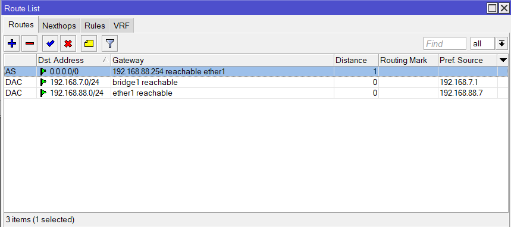
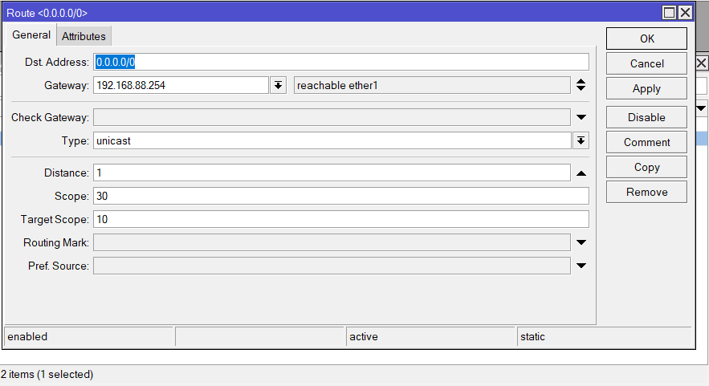
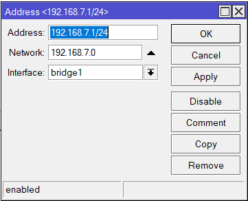
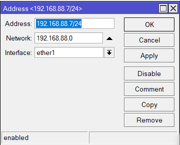
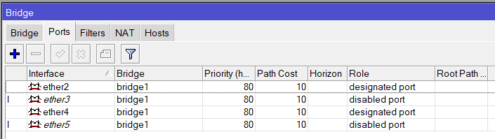
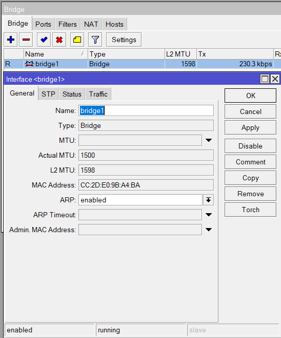
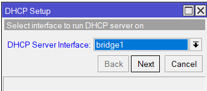
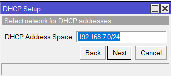
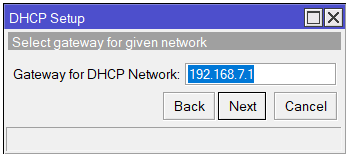
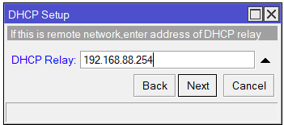

    Nama		        : Raihan Eka Pramudya
    NRP		        : 3122600011
    Kelas		        : 2 D4 Teknik Informatika A
    Mata Kuliah	        : Workshop Administrasi Jaringan
    Dosen Pengampu	        : Dr. Ferry Astika Saputra S.T., M.Sc
    

- # _Konfigurasi Mikrotik dengan Winbox untuk Internet_ 
**<h3 style="font-family:bahnschrift;">1. Menuju IP->Adresses.</h3>**

    

 

#

**<h3 style="font-family:bahnschrift;">2. Ubah konfigurasi address dan DNS seperti pada gambar.</h3>**

    

#

**<h3 style="font-family:bahnschrift;">3. Tes ping ke DNS google melalui terminal.</h3>**

    

**<h3 style="font-family:bahnschrift;">3. Tes ping ke DNS google melalui terminal.</h3>**

    

**<h3 style="font-family:bahnschrift;">3. Tes ping ke DNS google melalui terminal.</h3>**

    

**<h3 style="font-family:bahnschrift;">3. Tes ping ke DNS google melalui terminal.</h3>**

    

**<h3 style="font-family:bahnschrift;">3. Tes ping ke DNS google melalui terminal.</h3>**

    

**<h3 style="font-family:bahnschrift;">3. Tes ping ke DNS google melalui terminal.</h3>**

    

**<h3 style="font-family:bahnschrift;">3. Tes ping ke DNS google melalui terminal.</h3>**

    

**<h3 style="font-family:bahnschrift;">3. Tes ping ke DNS google melalui terminal.</h3>**

    

