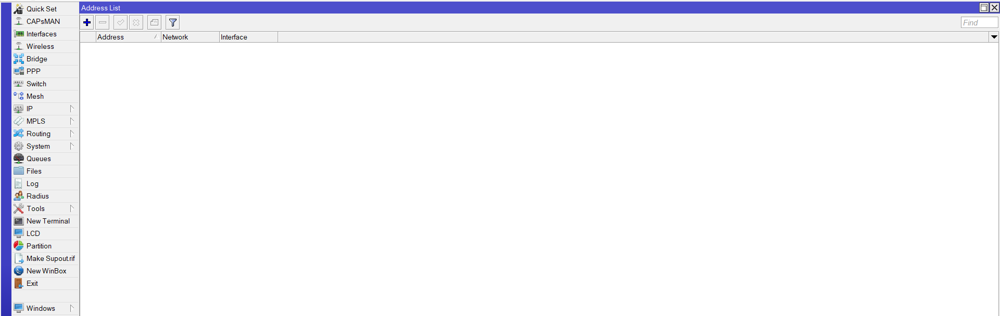
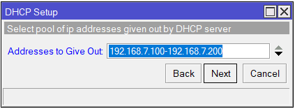

    Nama		        : Raihan Eka Pramudya
    NRP		        : 3122600011
    Kelas		        : 2 D4 Teknik Informatika A
    Mata Kuliah	        : Workshop Administrasi Jaringan
    Dosen Pengampu	        : Dr. Ferry Astika Saputra S.T., M.Sc
    

- # _Konfigurasi Mikrotik dengan Winbox untuk Internet_ 
**<h3 style="font-family:bahnschrift;">1. Menuju IP->Adresses lalu tambahkan pada address list.</h3>**

    

 

- 
 Isi address untuk router sesuai nomor kelompok 
    

  >
  Kelompok 7 maka address kita isi dengan 192.168.88.7/24, network (192.168.88.0), dan interface ether1.
  
- 
 Isi IP address untuk PC kelompok 7 
    

  >
  Kelompok 7 maka address kita isi dengan 192.168.7.1/24, network (192.168.7.0), dan interface bridge1.
#
**<h3 style="font-family:bahnschrift;">2. Mengisi Route pada Route List.</h3>**

    

#

**<h3 style="font-family:bahnschrift;">3. Set route dengan Gateway 192.168.88.254</h3>**

    

**<h3 style="font-family:bahnschrift;">4. Tambahkan .</h3>**

    

**<h3 style="font-family:bahnschrift;">3. Tes ping ke DNS google melalui terminal.</h3>**

    

**<h3 style="font-family:bahnschrift;">3. Tes ping ke DNS google melalui terminal.</h3>**

    

**<h3 style="font-family:bahnschrift;">3. Tes ping ke DNS google melalui terminal.</h3>**

    

**<h3 style="font-family:bahnschrift;">3. Tes ping ke DNS google melalui terminal.</h3>**

    

**<h3 style="font-family:bahnschrift;">3. Tes ping ke DNS google melalui terminal.</h3>**

    

    
