    Nama		        : Raihan Eka Pramudya
    NRP		        : 3122600011
    Kelas		        : 2 D4 Teknik Informatika A
    Mata Kuliah	        : Workshop Administrasi Jaringan
    Dosen Pengampu	        : Dr. Ferry Astika Saputra S.T., M.Sc
    

- # _INSTALL & KONFIGURASI BIND9_

## Install bind9, bind9-doc dan bind9-dnsutils 

  - Memasukkan perintah `sudo apt install bind9 bind9-doc bind9-dnsutils`
    >Perintah ini digunakan untuk melakukan instalasi bind9 dan tools konfigurasi

    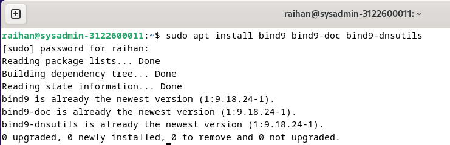
    
## Konfigurasi

  - Masukkan perintah `cd /etc/bind` untuk masuk ke direktori ini, lalu ketik perintah  `sudo nano named.conf`
    >Perintah ini digunakan untuk mengedit isi dari `named.conf`. Lalu, edit isinya seperti berikut : 
  
    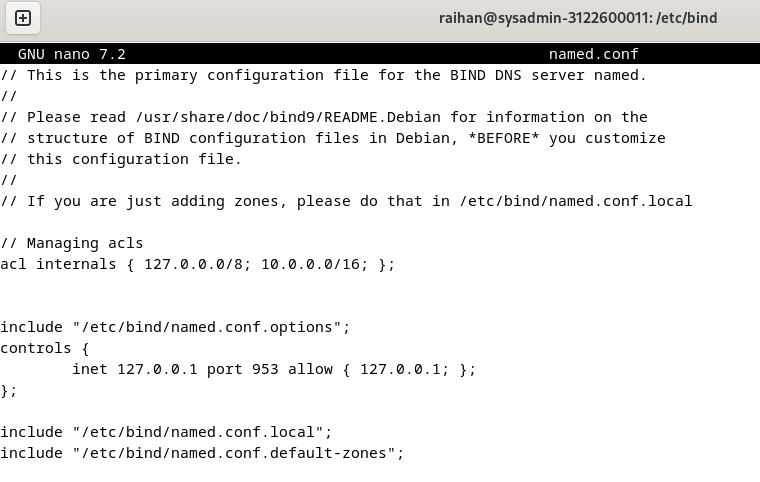

  - Masukkan perintah `sudo nano named.conf.options`
    > Perintah ini digunakan untuk mengedit isi dari `named.conf.options`, dan edit isinya menjadi seperti berikut : 

    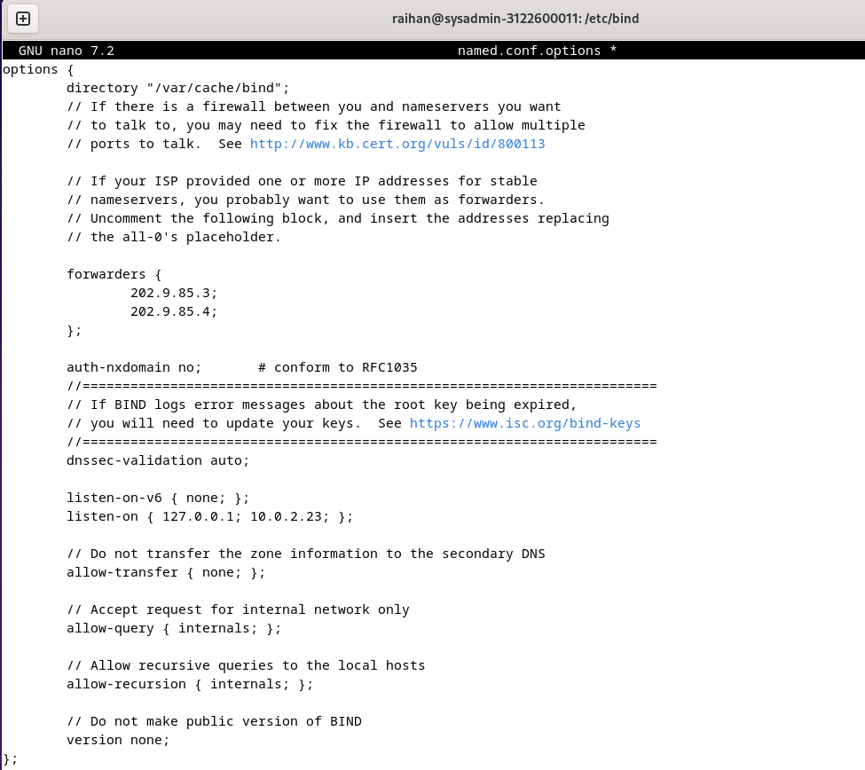

  - Masukkan perintah `sudo nano named.conf.local`
    >Perintah ini digunakan untuk mengedit isi dari `named.conf.local`, dan edit isinya menjadi seperti berikut :

    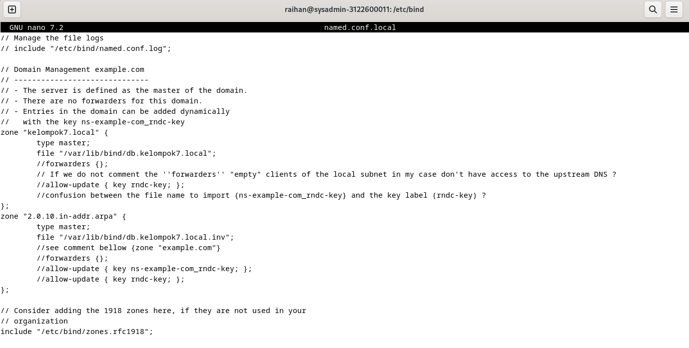

  - Masukkan perintah `cd /var/lib/bind` untuk masuk ke direktori ini, lalu ketik perintah `sudo touch db.kelompok7.local` untuk membuat file kosong yang bernama `db.kelompok7.local`.

  - Masukkan  perintah `sudo nano db.kelompok7.local` 
    >Perintah ini digunakan untuk mengedit isi dari `db.kelompok7.local`, dan edit sehingga menjadi seperti berikut :
    
    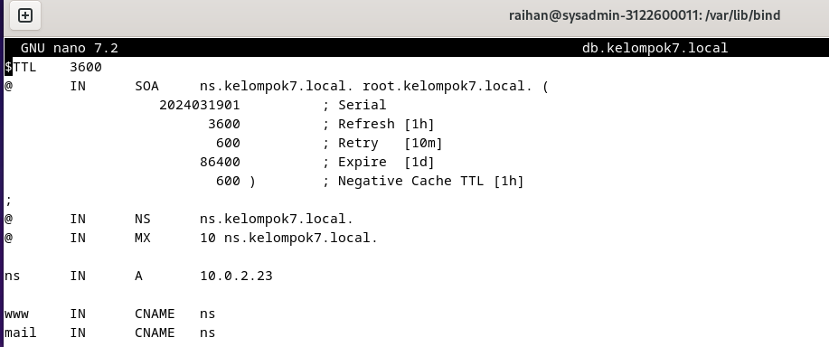

  - Masukkan perintah `sudo touch db.kelompok7.local.inv` yang digunakan untuk membuat file kosong yang bernama `db.kelompok7.local.inv`.
  
  - Masukkan perintah `sudo nano db.kelompok7.local.inv`
    >Perintah ini digunakan untuk mengedit isi dari file `db.kelompok7.local.inv` dan edit isinya menjadi seperti berikut : 

    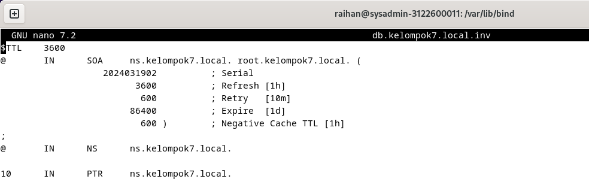

  - Masukkan perintah `cd` untuk keluar dari direktori `/var/lib/bind` dan masukkan perintah `sudo nano /etc/resolv.conf` untuk mengedit isinya, hingga seperti berikut
    
    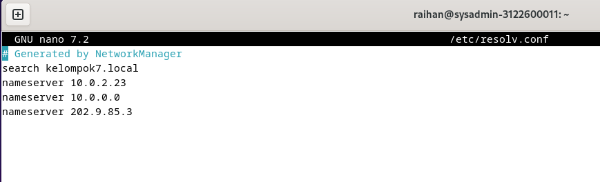

  - Masukkan perintah `named-checkzone kelompok7.local db.kelompok7.local` untuk mengecek domainnya, dan masukkan perintah`named-checkzone 2.0.10.inaddr-arpa` untuk mengecek domain inversnya.
  
    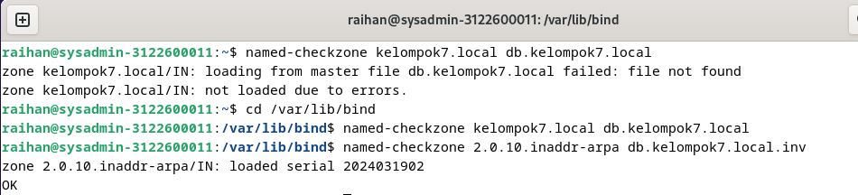

  - Masukkan perintah `sudo systemctl restart named` untuk melakukan restart pada domain named, kemudian lakukan tes dengan mengetikkan perintah `sudo systemctl status named`
    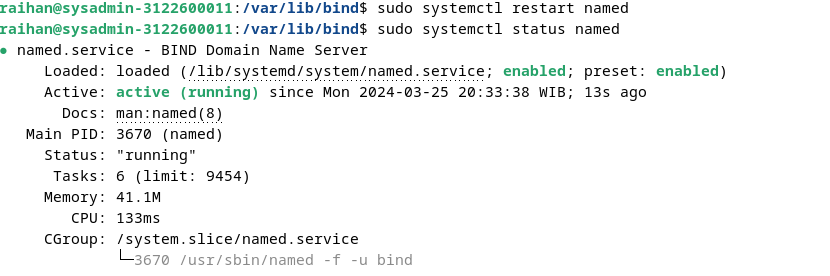

  - Masukkan perintah `dig kelompok7.local` untuk domain yang dibuat per-kelompok dan `dig -x 10.0.2.23`
    >Perintah ini digunakan untuk melakukan pengecekan informasi lebih lanjut pada domain

    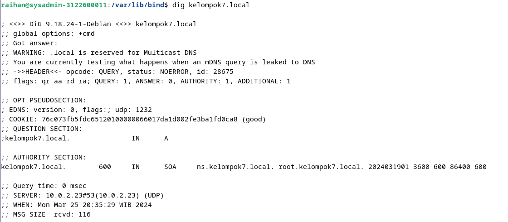
    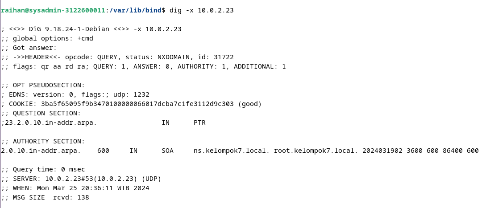

  - Masukkan perintah `nslookup ns` untuk melakukan query DNS dan melihat detail dari ns dan `nslookup -q=MX` yang digunakan untuk melihat detail domain mailnya
    
    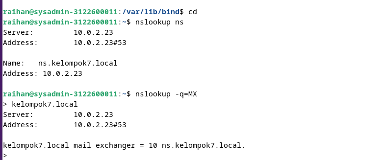

