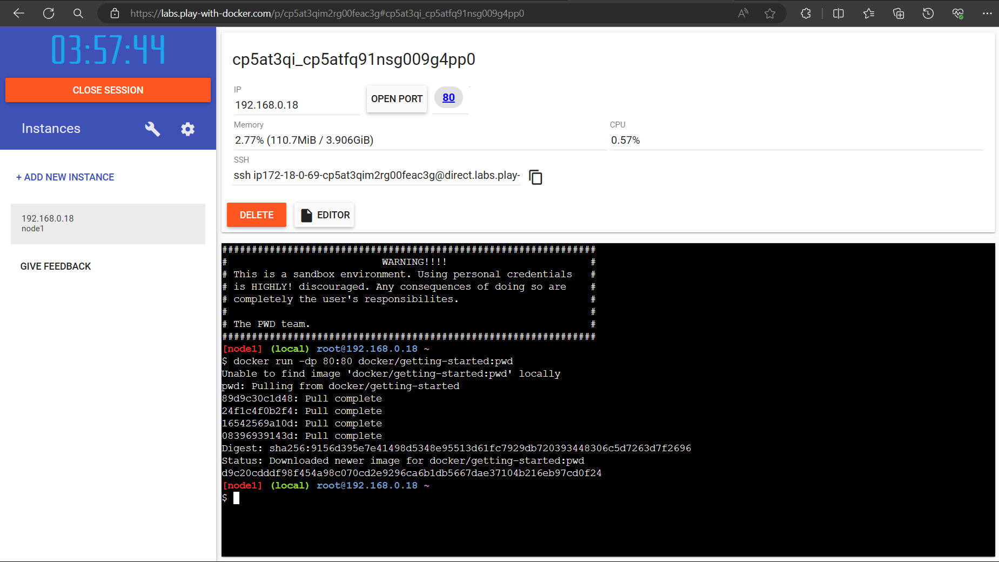
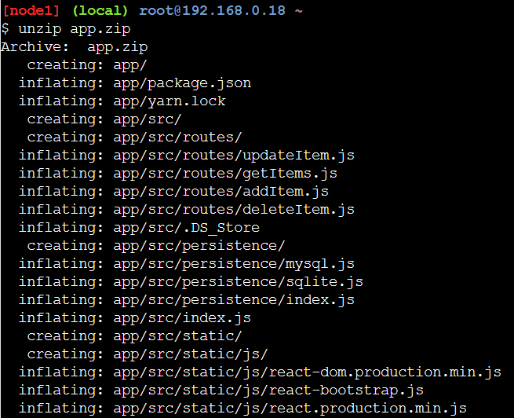
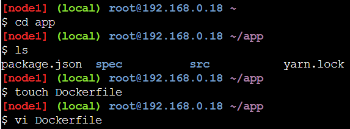
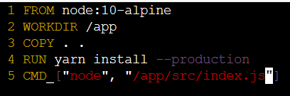
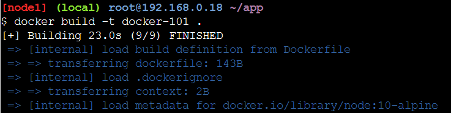
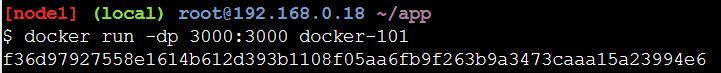

    Nama		        : Raihan Eka Pramudya
    NRP		        : 3122600011
    Kelas		        : 2 D4 Teknik Informatika A
    Mata Kuliah	        : Workshop Administrasi Jaringan
    Dosen Pengampu	        : Dr. Ferry Astika Saputra S.T., M.Sc
    

- # _DOCKER 101_

## - GETTING STARTED

1. Setelah masuk ke labs buat instance baru.
2. Setelah terminal muncul masukkan kode berikut untuk membuka port 80 yang berisi tutorial.
   ```bash
   docker run -dp 80:80 docker/getting-started:pwd
   ```


## - OUR APPLICATION

1. Download file app.zip pada laman tutorial.
2. Ekstrak file tersebut dengan mengetikkan kode berikut pada terminal.
   ```bash
   unzip app.zip
   ```
   

3. Pindah ke direktori app dengan perintah.
   ```bash
   cd app/
   ```
4. Lihat isi dari direktori dengan perintah
   ```bash
   ls
   ```
5. Buat dan isi file bernama Dockerfile dengan perintah.
   ```bash
   touch Dockerfile
   vi Dockerfile
   ```


6. Tambahkan kode berikut ke dalam file.
   ```bash
    FROM node:10-alpine
    WORKDIR /app
    COPY . .
    RUN yarn install --production
    CMD ["node", "/app/src/index.js"]
   ```
   

7. Buat Container Image dengan perintah.
   ```bash
   docker build -t docker-101 .
   ```
   

8. Memulai kontainer dengan perintah.
   ```bash
   docker run -dp 3000:3000 docker-101
   ```
   
8. 
9. 
- Melakukan pengiriman pesan
  ketik `telnet mail.kelompok4.local 25` lalu masukkan sintaks berikut:
  - `HELO` untuk memulai sesi Telnet dengan server
  - `MAIL FROM:` untuk mendefinisikan alamat email pengirim
  - `RCPT TO:` untuk mendefinisikan alamat email penerima
  - `DATA` untuk memasukkan isi dari email yang dikirim
  
  
  >Jika muncul output tersebut, maka email berhasil dikirim ke alamat tujuan

- Pengecekan pesan yang masuk
  ketik `telnet mail.kelompok4.local 110` lalu masukkan sintaks berikut:
  - `user` untuk memasukkan username dari user
  - `pass:` untuk memasukkan password dari user
  - `list:` untuk melihat list dari email yang diterima
  - `RETR {index}` untuk melihat isi pesan dari index tertentu
  
  
  
## - MENGGUNAKAN DEBIAN EVOLUTION

- Melakukan pengiriman pesan
  - Masukkan email pengirim
  - Masukkan email pengirim
  - Masukkan pesan yang akan dikirim
  
  

  Jika berhasil, maka akan muncul seperti gambar berikut: 

  
  
## - MENGGUNAKAN ROUNDCUBE

1. Lakukan instalasi roundcube dengan perintah
   ```bash
   sudo apt install roundcube
   ```


2. Lalu kita buat MariaDB database dan user untuk roundcubenya


3. Lalu konfigurasi config.inc.php di roundcube.


4. Konfigurasi apache.conf.


5. Konfigurasi 000-default.conf.


6. Lalu kita rekonfigurasi dengan perintah
   ```bash
   sudo dpkg-reconfigure roundcube-core
   ```


